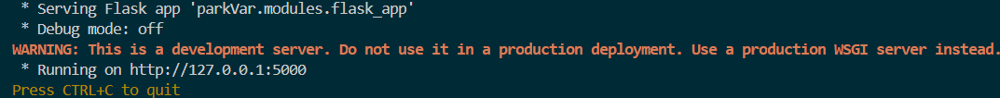

<span style="font-size: 2em; font-weight: bold;">README</span>

# parkVar

A tool that validates variants and annotates them with metadata from ClinVar.

---

## Features

- **Variant validation**
  Uses the VariantValidator API to check that submitted variants are correctly formatted and biologically valid.

- **ClinVar annotation**
  Queries the ClinVar API to retrieve metadata such as clinical significance and review status.

- **Flask web interface**
  Provides a simple UI for uploading variant files, running validation and annotation, and viewing results in the browser.

- **CSV input support**
  Currently accepts CSV files as input. Output is displayed in the web interface, with plans for future database integration.

---

## Installation

You can install `parkVar` manually using a Python environment or via Docker.

### Requirements
- Python 3.13 (via Conda environment)
- pip
- Internet connection (required for VariantValidator and ClinVar API calls)

### Manual Installation

1. **Clone the repository**

    Clone repository from GitHub.

```bash
   git clone https://github.com/Emily-Amies/parkVar.git
   cd parkVar
```

2. **Create and activate the Conda environment**

   From the project root, create environment using `environment.yml`.

```bash
   conda env create -f environment.yml
   conda activate parkvar_env
```

3. **Install parkVar**

    From the project root, install parkVar.

```bash
    pip install .
```

### Docker Installation

To run this app in a Docker container (see [Docker installation section of the INSTALLATION.md](INSTALLATION.md) for more detail):

1. Ensure that:
    - Docker is installed on your machine
    - You are in the app's root folder (i.e. in the same folder as the Dockerfile and `the docker-compose.yml`)
    - Port 5000 on your machine is available (i.e. not already being used by another service)


2. Build and run the app with Docker compose:

```bash
docker compose up -d --build
```

3. The container should now be up and running, which you can check using:

```bash
docker ps
```

4. Open [http://localhost:5000](http://localhost:5000) in your browser to interact with the app (see [Quick Start](#quick-start) section for more information).

5. Once you are finished with the app you can stop the container by running:

```bash
docker compose down
```
---

## Quick Start

Once installed, you can launch the parkVar web interface in just a few steps.

1. **Activate the environment**

```bash
conda activate parkvar_env
```

2. **Start the application**

From `parkVar` run the main script.

```bash
python main.py
```

3. **Open the web interface**

When the server starts, a hyperlink will appear in the terminal. Click the link to open parkVar in your browser.



4. **Upload a CSV**

Use the upload page to submit a variant CSV. parkVar will validate the variants using VariantValidator and annotate them with ClinVar metadata. You're now ready to explore the results through the web interface.

---

## Testing

parkVar includes a full test suite located in the `tests/` directory at the project root. Tests are written using `PyTest` and can be run with coverage reporting.

### Running the tests

From the root:

```bash
pytest --cov=. --cov-report=term-missing [-v]
```

---

## Contributing

Contributions are welcome. If you would like to add features, fix bugs, or improve the documentation, please follow the steps below:

1. **Fork the repository** on GitHub.
<br>
2. **Create a new branch** for your changes:

```bash
   git checkout -b feature-name
```

3. **Make your changes** and include tests with adequate coverage
<br>
4. **Submit a Pull Request** with a brief description of what you’ve done.

Please keep code style consistent with the existing project (`ruff` is included in the environment), and run tests before opening a PR.

---

## Licence

Please see [LICENSE.txt](LICENSE.txt).

---

## Future Work

The following features are planned for future releases of `parkVar`:

- **Database integration**
  Store validated and annotated variants in a structured database rather than csv files.

- **Search functionality**
  Allow users to search for specific variants, genes, or metadata fields within stored results.

- **Improved filtering options**
  Enable filtering by additional columns such as gene symbol, clinical significance, or review status.

- **Selectable output columns**
  Allow users to choose which annotation fields appear in the results table.

These features are under active development and will expand `parkVar` further.
