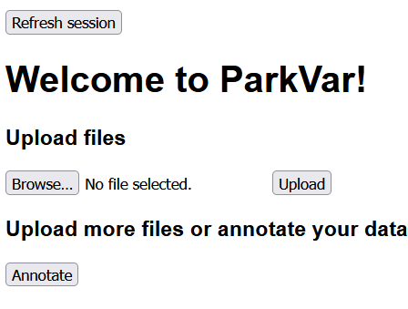
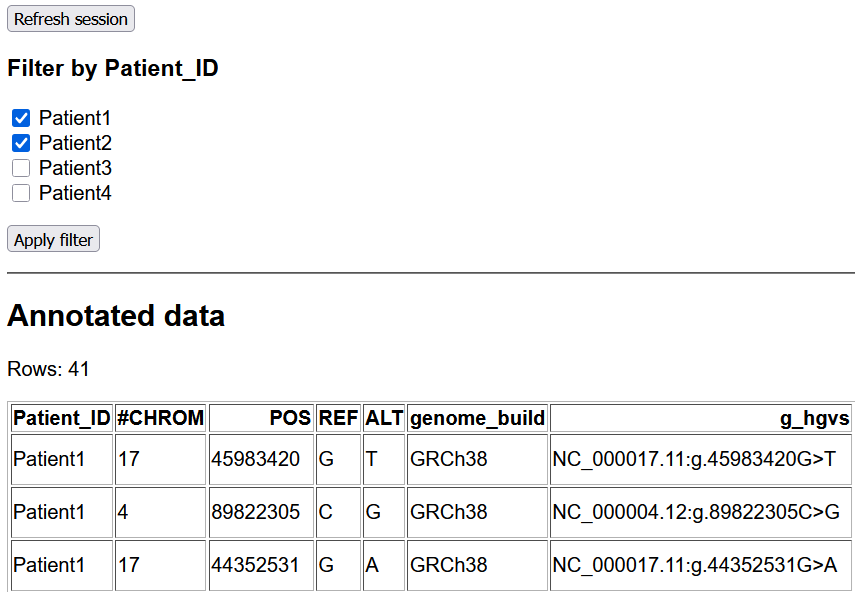
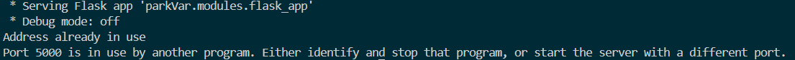

# User Manual

# parkVar

This application is a Flask-based web tool for validating and annotating genomic variants.

Users upload CSV files derived from VCFs, which are first validated using the VariantValidator API to ensure variant representations are correct. Valid variants are then annotated using the ClinVar API to add clinical significance and related metadata.

Once processing is complete, the results are displayed in a table within the web interface. The table can be filtered by patient, allowing users to quickly inspect and compare variants on a per-patient basis.

---

## Inputs

### Variant input file

The application accepts a single input file in CSV format containing variant data.

Direct upload of VCF files is not supported. This is an intentional design decision, as the developers of GATK recommend [against parsing VCFs](https://gatk.broadinstitute.org/hc/en-us/articles/360035531692-VCF-Variant-Call-Format) and instead advises converting them into tab or comma-delimited formats using tools such as `VariantsToTable`.

Users should therefore convert VCF files to CSV prior to upload. Guidance on VCF conversion can be found in the [GATK documentation](https://gatk.broadinstitute.org/hc/en-us/articles/360036711531-VariantsToTable).

### Required fields

The CSV file must contain a defined set of mandatory fields for validation and annotation.

- `CHROM` – Chromosome identifier.
- `POS` – 1-based genomic position of the variant.
- `REF` – Reference allele.
- `ALT` – Alternate allele.

These fields are required for variant validation and annotation. Missing information will result in incomplete annotation or app failure.

---

## Outputs

This application does not generate downloadable output files.

Instead, results are displayed in the web interface. Variants are displayed in a table with information from the VariantValidator and ClinVar APIs.

The results table supports filtering by patient, allowing users to focus on variants associated with a specific sample.

---

## Standard workflow

1. Upload one or more CSV files using the **Upload** button. The interface will display the latest uploaded file.
2. Click **Annotate** to validate and annotate the variants.
   This step may take some time, depending on the number of variants and API response times.




3. Once processing is complete, the results table will be displayed in the browser.
4. Filter the results by selecting one or more patient checkboxes and clicking **Filter**.
5. The session can be refreshed at any point using the **Refresh Session** button to clear the current state and start again.




---

## Troubleshooting

### Address already in use

**Problem**
When starting the application, you may see an error indicating that the address or port is already in use. This usually occurs if a previous instance of the Flask application is still running.

**Example error**

```
Address already in use
Port 5000 is in use by another program.
```




**Cause**
Port 5000 is already occupied by another process, often because an earlier Flask session was not shut down properly.

**Resolution**
Identify and terminate the process(es) using port 5000:

```bash
lsof -i :5000 # Get id(s)
kill -9 <id(s)>
```

Replace `<id(s)>` with the process ID(s) returned by the `lsof` command. Once the process has been stopped, restart the application.

## Log file permissions errors after running app in Docker
- If you intend to use this app locally after running the app in Docker it is recommended that you copy any data held in the `logs/` and `data/` to an alternative location (if you wish to keep it) and delete the existing data/ logs/ directories `sudo rm -r data/ logs/` before trying to run the app locally. This is because permission issues can arise when modifying/writing to files created by a Docker container, rather than the by local user. Alternatively, adjust permissions via `chmod` for these files before running locally.
